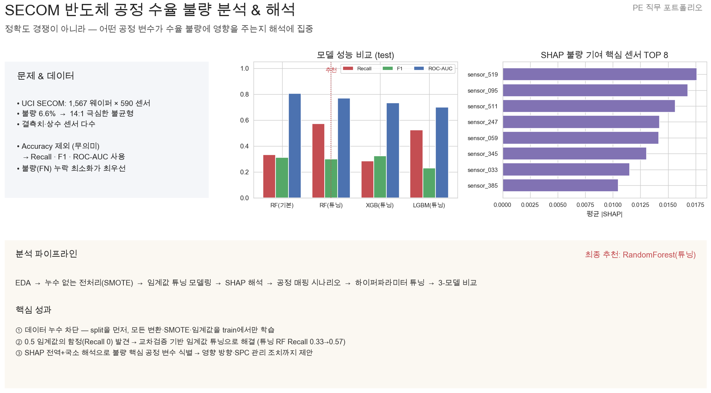
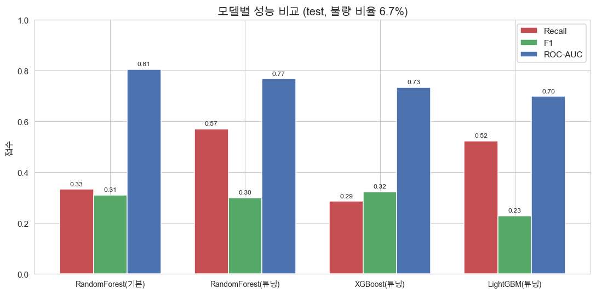
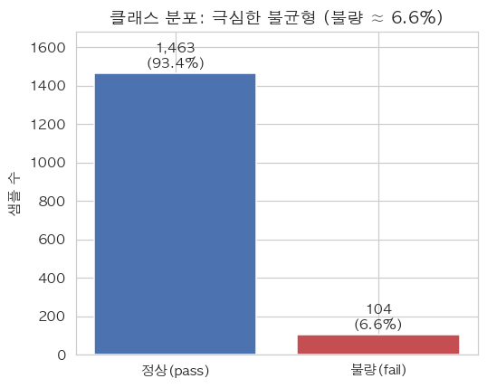
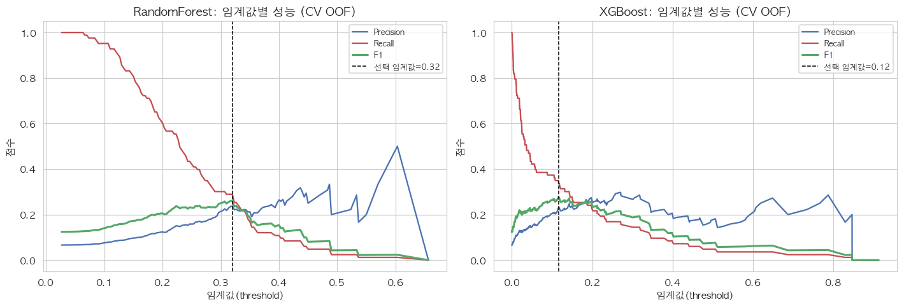
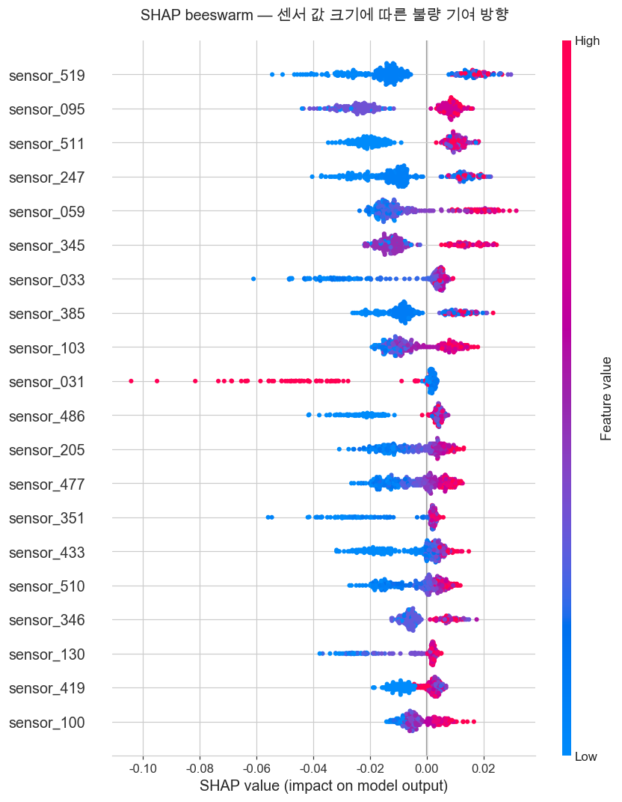
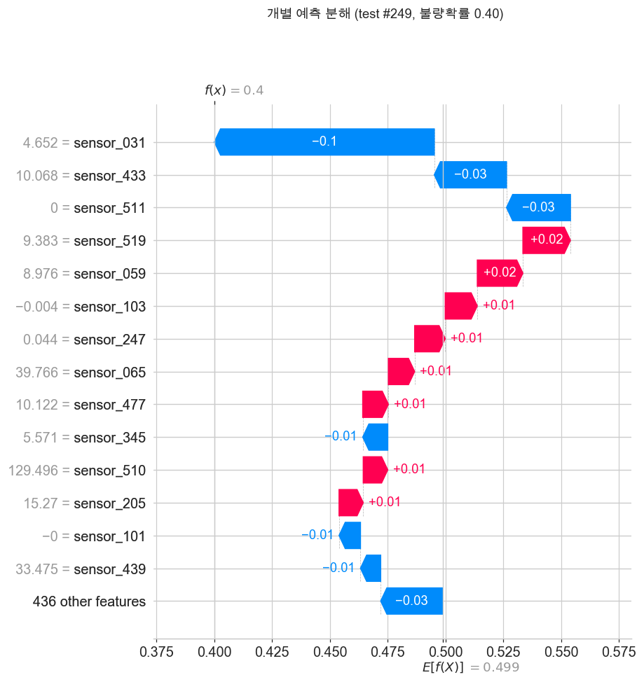
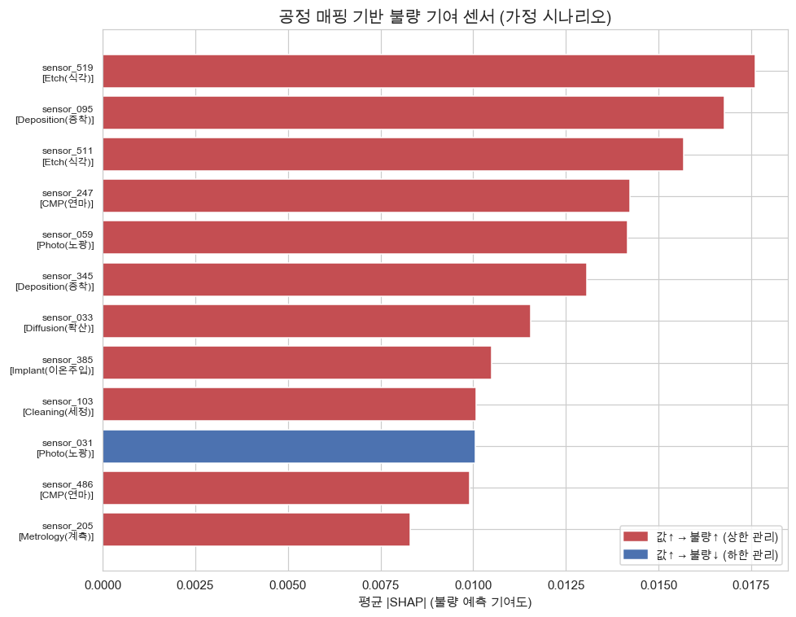

# SECOM 반도체 공정 수율 불량 분석 & 해석

공개 반도체 공정 데이터(UCI SECOM)로 수율 불량을 예측하고, **어떤 공정 변수가 불량에 영향을 주는지 SHAP으로 해석**하는 Product Engineering(PE) 직무 포트폴리오 프로젝트.

> "단순히 모델 정확도를 높이는 것이 아니라, 어떤 공정 변수가 수율 불량에 영향을 주는지 해석하는 데 집중했습니다."



---

## 핵심 결과 (test 기준)

| 모델 | Recall | Precision | F1 | ROC-AUC |
|---|---|---|---|---|
| RandomForest (기본) | 0.333 | 0.292 | 0.311 | **0.805** |
| **RandomForest (튜닝)** ⭐ 최종 추천 | **0.571** | 0.203 | 0.300 | 0.768 |
| XGBoost (튜닝) | 0.286 | **0.375** | **0.324** | 0.734 |
| LightGBM (튜닝) | 0.524 | 0.147 | 0.229 | 0.699 |

- 불량 6.6%의 극심한 불균형 → **Accuracy 미사용**, 불량 누락(FN) 최소화를 위해 **Recall 우선**
- "단일 최강 모델"은 없음 → **목적(Recall 우선)에 따라 모델·임계값을 선택**하는 의사결정 논리가 핵심
- 최종 추천 모델: `outputs/models/final_model.joblib` (RandomForest 튜닝, threshold=0.279)



---

## 데이터
- UCI SECOM: 1,567 웨이퍼 × 590 센서 피처, 이진 레이블(정상 -1 / 불량 1)
- 불량 비율 6.64% (불균형 14:1), 결측치·상수 센서 다수

| 항목 | 값 |
|---|---|
| 샘플 × 피처 | 1,567 × 590 |
| 불량 비율 | 6.64% (불균형 14.1:1) |
| 결측치 50%↑ 컬럼 | 24개 (train 기준 제거) |
| 분산 0 컬럼 | 116개 (제거) |
| 전처리 후 피처 | **450개** |



---

## 분석 파이프라인 & 단계별 산출물

| Step | 노트북 | 핵심 |
|---|---|---|
| 1. EDA | `01_eda.ipynb` | shape/결측/클래스/분포 → *단일 센서로 구분 불가 = 다변수 현상* |
| 2. 전처리 | `02_preprocessing.ipynb` | split 먼저 → 모든 변환·SMOTE를 **train에서만** (누수 차단) |
| 3. 모델링 | `03_modeling.ipynb` | **0.5 임계값에서 Recall=0** 발견 → CV 기반 임계값 튜닝 |
| 4. SHAP 해석 | `04_shap_analysis.ipynb` | 불량 기여 핵심 센서 + bar/beeswarm/waterfall |
| 5. 공정 매핑 | `05_process_mapping.ipynb` | 영향 방향(데이터) + 가정 공정명 → SPC 관리 조치 제안 |
| 6. HPO | `06_hyperparameter_tuning.ipynb` | RandomizedSearchCV로 RF·XGB 튜닝 (RF Recall 0.33→0.57) |
| 7. 모델 비교 | `07_lightgbm_comparison.ipynb` | LightGBM 추가, 3-모델 동일 절차 비교 |
| 8. 요약 | `08_portfolio_summary.ipynb` | 전체 집계 + 1장 슬라이드 생성 |

### 핵심 성과 3가지
1. **데이터 누수 차단** — split을 먼저, 결측 기준·median·분산 판정·SMOTE·임계값을 모두 train에서만 학습
2. **0.5 임계값의 함정 발견·해결** — SMOTE로 학습해도 기본 임계값에선 Recall 0 → 교차검증으로 임계값을 정해 회복
3. **블랙박스 거부** — SHAP 전역+국소 해석으로 핵심 공정 변수 식별 → 영향 방향·관리 조치까지 제안

---

## 주요 시각화

| 임계값 튜닝 (0.5 함정 해결) | SHAP 핵심 센서 (방향성) |
|---|---|
|  |  |

| 개별 예측 분해 (waterfall) | 공정 매핑 시나리오 |
|---|---|
|  |  |

> 전체 그림은 [outputs/figures/](outputs/figures/) (총 12개), 공정 매핑 표는 [outputs/process_mapping_scenario.csv](outputs/process_mapping_scenario.csv) 참고.
> ⚠️ 공정 매핑의 공정명(Etch/Depo 등)은 **시연용 가정**이며, 영향 방향(값↑→불량↑/↓)만 데이터에서 산출한 값입니다.

---

## 환경 설정
```bash
python3 -m venv .venv
source .venv/bin/activate
pip install -r requirements.txt
# macOS에서 XGBoost/LightGBM용 OpenMP 런타임 필요
brew install libomp
python -m ipykernel install --user --name secom-pe --display-name "Python (secom-pe)"
```
노트북 실행 시 Jupyter 커널 **"Python (secom-pe)"** 선택. 각 노트북은 `01 → 08` 순서로 실행.

> 재생성 가능한 산출물(`data/processed/`, `outputs/models/`)은 저장소에 포함하지 않는다.
> 노트북 `02`(전처리)·`03`/`06`/`07`(모델)을 실행하면 자동 생성된다.

## 프로젝트 구조
```
반도체플젝/
├── data/
│   ├── secom.data, secom_labels.data   # 원본 (UCI)
│   └── processed/secom_processed.npz   # 전처리 결과
├── notebooks/                          # 01~08 노트북
├── outputs/
│   ├── figures/                        # 시각화 12개
│   ├── models/                         # 학습 모델 (+ final_model.joblib)
│   ├── process_mapping_scenario.csv
│   └── portfolio_slide.png             # 포트폴리오 1장 슬라이드
├── CLAUDE.md, README.md
```

## 한계 & 솔직한 평가
SECOM은 신호가 약한 어려운 공개 데이터라 절대 성능(Recall 0.57)은 높지 않다. 이 프로젝트의 가치는 점수가 아니라 **누수 없는 설계 · 임계값 의사결정 · 해석 가능성**이라는 방법론에 있으며, 이는 수율 개선을 다루는 PE 업무와 직접 맞닿아 있다.
